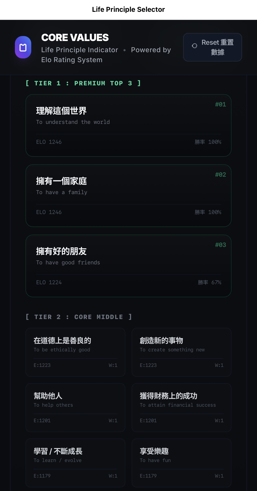
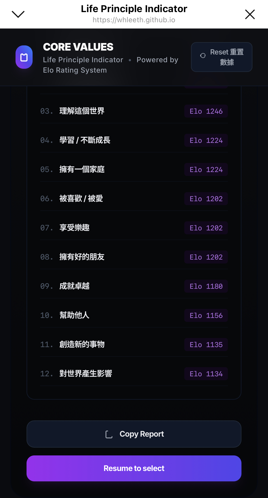
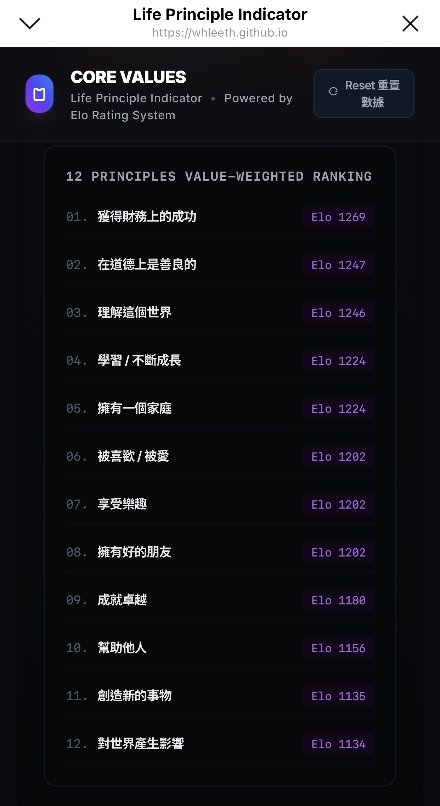
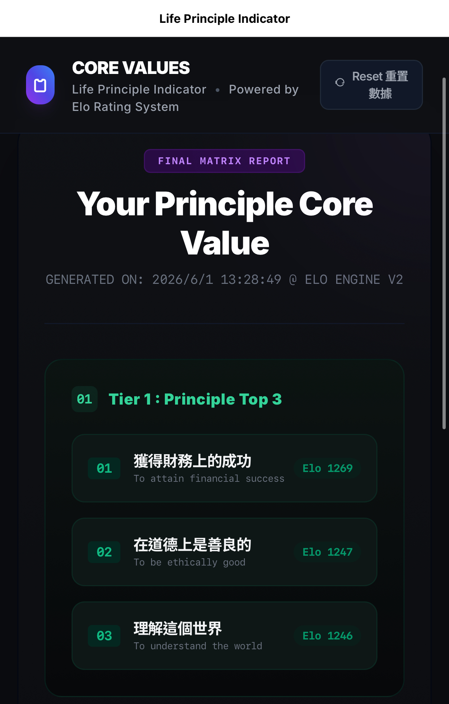

# CORE VALUES - Life Principle Selector

一個以 `Elo Rating` 概念設計的單頁互動式價值觀排序網站。使用者會在兩個人生價值之間反覆做選擇，系統會依照每次決策調整分數，最後產出一份屬於自己的「核心價值架構報告」。

## Demo 連結

- Live Demo: [Open the site](https://whleeth.github.io/lifePrinciple/)

## 專案截圖

## 專案特色

- 以兩兩對決的方式，快速整理使用者的優先價值
- 內建 `Elo` 排名機制，讓每次選擇都會影響最終結果
- 支援滑鼠點選、鍵盤左右鍵、手機滑動操作
- 可復原上一步、重置資料、生成報告、複製報告文本
- 介面為深色系卡片風格，適合桌機與手機瀏覽

## 頁面功能

- `CORE VALUES` 主畫面：進行價值觀對決
- `Undo`：返回上一步選擇
- `Reset`：重置所有排序資料
- `Generate Report`：產出完整結果報告
- `Copy Report`：複製文字版報告到剪貼簿
- `Resume Duel`：返回對決頁面繼續調整結果

## 使用方式

1. 直接用瀏覽器開啟 `index.html`
2. 依照畫面提示，在兩個價值之間選出你較重視的一項
3. 持續完成多輪對決後，點選生成報告查看結果
4. 可將報告複製到其他地方分享

## 技術內容

- HTML5
- Tailwind CSS CDN
- 原生 JavaScript
- Google Fonts

## 備註

- 這是一個單檔靜態頁面，沒有額外的 `package.json` 或前端框架依賴
